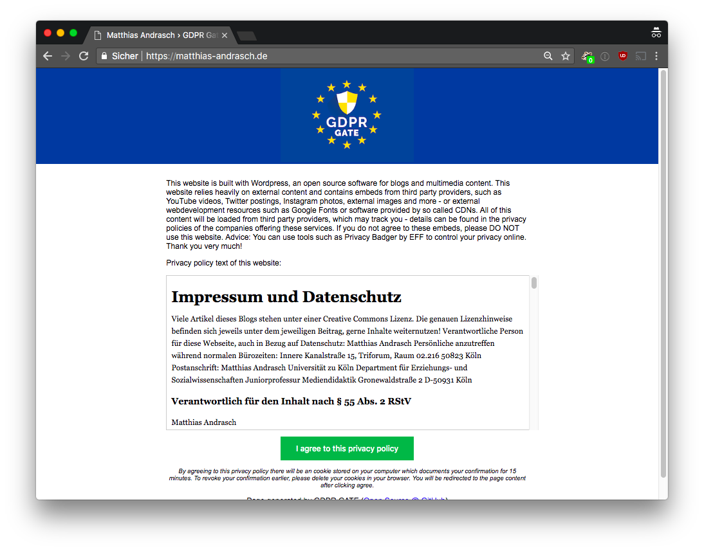

# GDPR GATE
Consent page plugin for wordpress - consent first, content later.
BEWARE: Alpha version, DO NOT use in production.

## Installation
1. copy/upload to wp-content/plugins
2. Set privacy page in Wordpress options -> privacy
3. Happy Hacking

## DEMO

## Limitations
- currently does not work with cache plugins
- may not work with multisite (subdomain pages)
- it may hurt your SEO reputation (suggestions welcome for HTTP Header Status)
- it possibly won't allow search engine robots to access the page (see gdpr-gate is_crawler(), suggestions welcome)
- no multilanguage right now
- is possibly not 100% compliant with GDPR (legal suggestions also welcome)
- if there is tracking before template_redirect hook, then this should be mentioned in privacy policy

## How does it work?
1. Check if user has consent cookie stored (in wordpress hook template_redirect)
2. If no cookie is present, redirect to special page for consent (theme, plugins, etc. will NOT be loaded)
3. Load privacy policy page from Wordpress Backend (Settings->Privacy) and show text-only version to prevent third party embeds
4. User clicks consent, JS-Cookie sets consent cookie for 15 minutes
5. Reload page via JS, content is shown (best case ;-))

Fork of Simple Maintenance by naa986, thanks very much!
https://de.wordpress.org/plugins/simple-maintenance/
(License: GPLv2 or later
License URI: http://www.gnu.org/licenses/gpl-2.0.html)

GDPR GATE LOGO BY BENEDIKT GEYER (https://pixabay.com/de/users/BenediktGeyer-1771636/)
